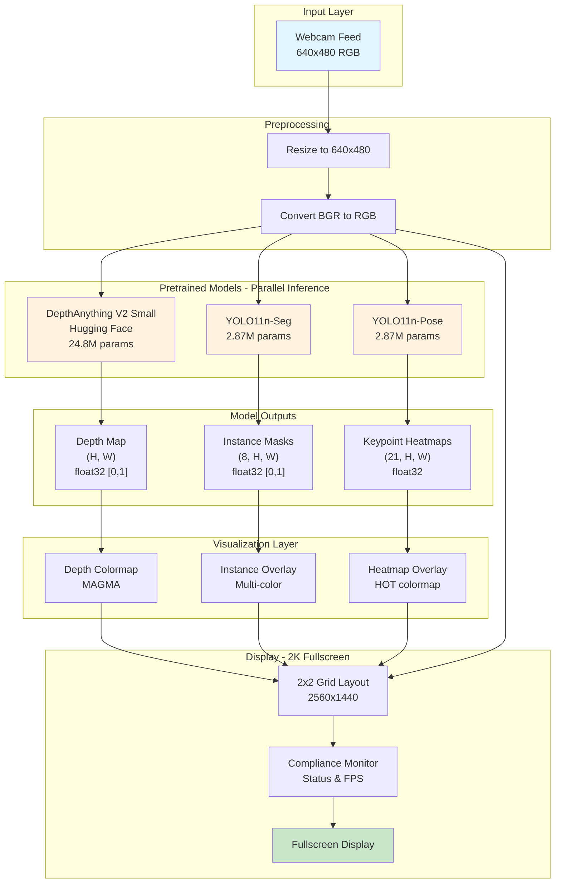
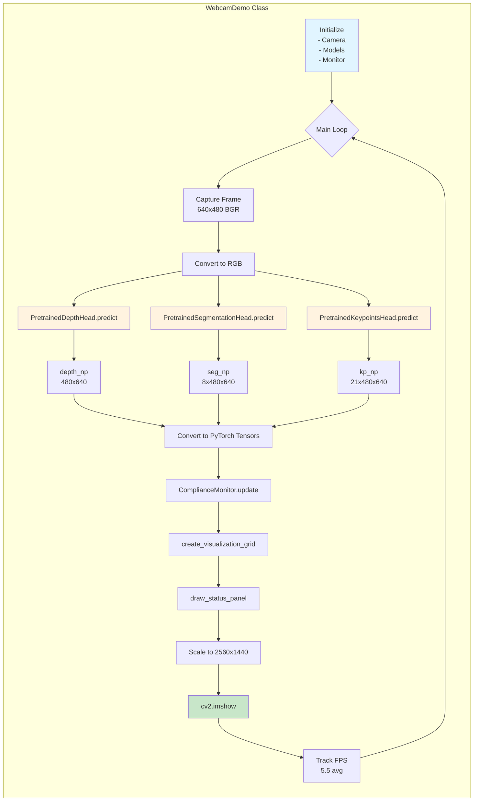
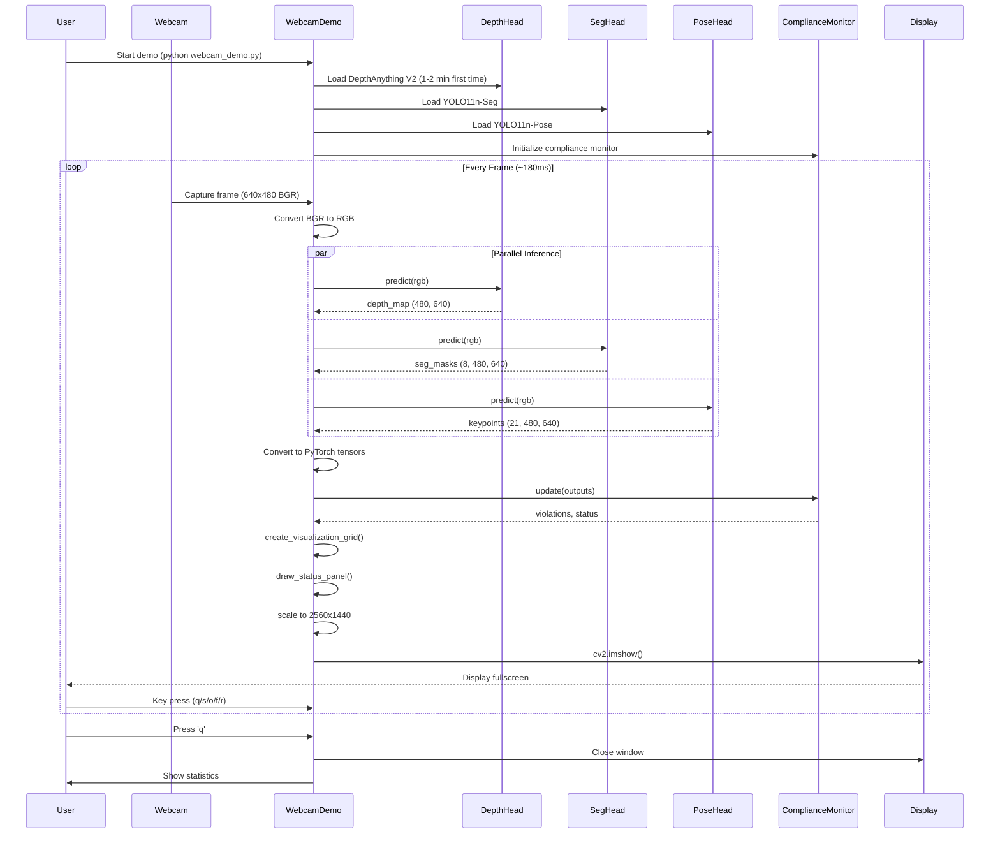
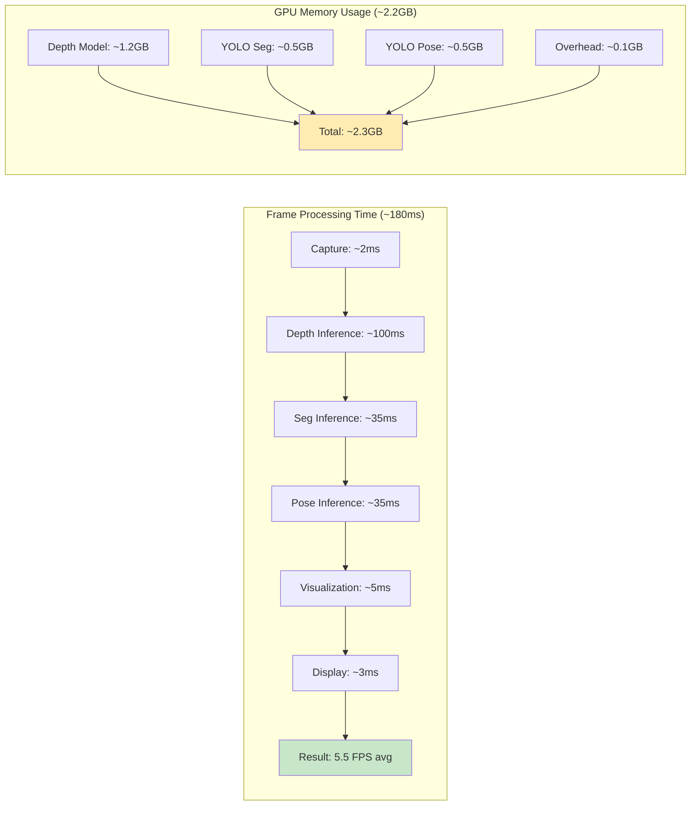
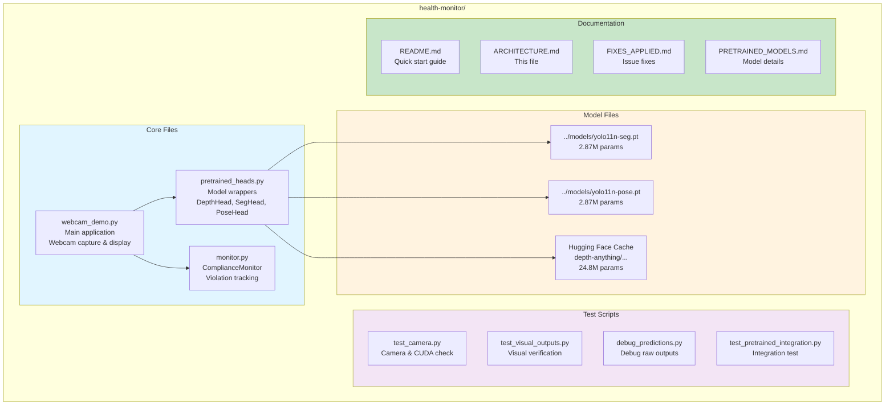
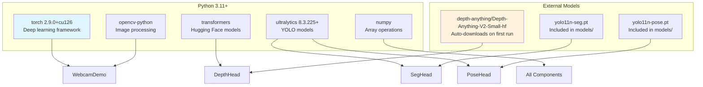
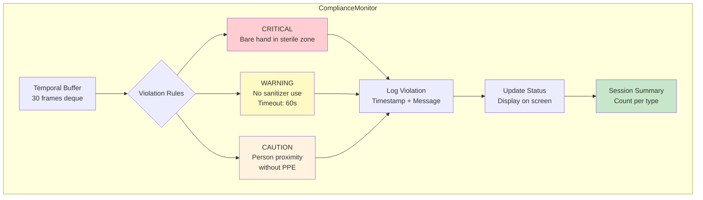
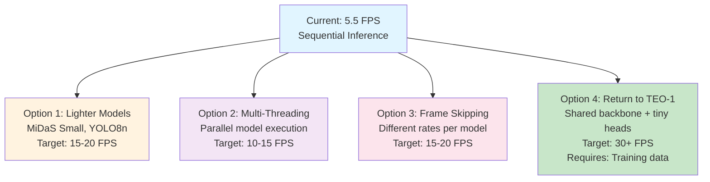

# CLABSIGuard V2 Architecture

## System Overview

CLABSIGuard V2 is a real-time healthcare monitoring system that uses three pretrained state-of-the-art computer vision models running in parallel to provide depth estimation, instance segmentation, and pose estimation.

## High-Level Architecture



## Detailed Component Architecture



## Model Details

```mermaid
graph TB
    subgraph DepthModel["DepthAnything V2 Small"]
        DepthInput["Input: PIL Image<br/>RGB uint8<br/>Any size"]
        DepthPipeline["HF Pipeline<br/>depth-estimation"]
        DepthArch["Architecture:<br/>DINOv2 ViT-S Encoder<br/>DPT Decoder"]
        DepthParams["24.8M parameters<br/>~1.2GB VRAM"]
        DepthTime["Inference: ~80-100ms"]
        DepthOutput["Output: Depth Map<br/>(H, W) float32<br/>Normalized [0, 1]"]

        DepthInput --> DepthPipeline
        DepthPipeline --> DepthArch
        DepthArch --> DepthParams
        DepthParams --> DepthTime
        DepthTime --> DepthOutput
    end

    subgraph SegModel["YOLO11n-Seg"]
        SegInput["Input: RGB uint8<br/>(H, W, 3)"]
        SegResize["Auto-resize to 640x640"]
        SegArch["Architecture:<br/>CSPDarknet + C2PSA<br/>102 Conv layers"]
        SegParams["2.87M parameters<br/>~0.5GB VRAM"]
        SegTime["Inference: ~30-40ms"]
        SegDetect["Detect Objects<br/>80 COCO classes"]
        SegMask["Generate Masks<br/>Per instance"]
        SegOutput["Output: (8, H, W)<br/>8 instance masks<br/>float32 [0, 1]"]

        SegInput --> SegResize
        SegResize --> SegArch
        SegArch --> SegParams
        SegParams --> SegTime
        SegTime --> SegDetect
        SegDetect --> SegMask
        SegMask --> SegOutput
    end

    subgraph PoseModel["YOLO11n-Pose"]
        PoseInput["Input: RGB uint8<br/>(H, W, 3)"]
        PoseResize["Auto-resize to 640x640"]
        PoseArch["Architecture:<br/>CSPDarknet + C2PSA<br/>98 Conv layers"]
        PoseParams["2.87M parameters<br/>~0.5GB VRAM"]
        PoseTime["Inference: ~30-40ms"]
        PoseDetect["Detect People"]
        PoseKP["Extract 17 COCO<br/>Keypoints per person"]
        PoseGauss["Generate Gaussian<br/>Heatmaps (sigma=15)"]
        PoseOutput["Output: (21, H, W)<br/>21 keypoint heatmaps<br/>float32"]

        PoseInput --> PoseResize
        PoseResize --> PoseArch
        PoseArch --> PoseParams
        PoseParams --> PoseTime
        PoseTime --> PoseDetect
        PoseDetect --> PoseKP
        PoseKP --> PoseGauss
        PoseGauss --> PoseOutput
    end

    style DepthModel fill:#fff3e0
    style SegModel fill:#fff3e0
    style PoseModel fill:#fff3e0
```



## Visualization Pipeline

```mermaid
graph TB
    subgraph GridLayout["2x2 Grid Visualization"]

        subgraph TL["Top-Left: Input + Keypoints"]
            InputFrame[Original Frame<br/>640x480 RGB]
            DrawKP[Draw Keypoint Circles<br/>Green dots at peaks]
            DrawLines[Draw Skeleton<br/>Cyan lines]
            TLOut[Input with Overlay]

            InputFrame --> DrawKP
            DrawKP --> DrawLines
            DrawLines --> TLOut
        end

        subgraph TR["Top-Right: Depth"]
            DepthMap[Depth Map<br/>480x640 float32]
            NormDepth[Normalize to [0, 255]]
            ApplyMAGMA[Apply MAGMA Colormap<br/>Purple to Yellow]
            TROut[Colored Depth]

            DepthMap --> NormDepth
            NormDepth --> ApplyMAGMA
            ApplyMAGMA --> TROut
        end

        subgraph BL["Bottom-Left: Segmentation"]
            SegMasks[8 Instance Masks<br/>8x480x640]
            ThreshMasks[Threshold at 0.5<br/>Binary masks]
            ColorMasks["Apply Colors:<br/>Red, Green, Blue, Yellow,<br/>Magenta, Cyan, Orange, Purple"]
            BLOut[Colored Instances]

            SegMasks --> ThreshMasks
            ThreshMasks --> ColorMasks
            ColorMasks --> BLOut
        end

        subgraph BR["Bottom-Right: Keypoint Heatmaps"]
            KPHeatmaps[21 Keypoint Heatmaps<br/>21x480x640]
            SumHeatmaps[Sum all channels]
            NormHM[Normalize to [0, 255]]
            ApplyHOT[Apply HOT Colormap<br/>Black to Yellow to White]
            BROut[Keypoint Visualization]

            KPHeatmaps --> SumHeatmaps
            SumHeatmaps --> NormHM
            NormHM --> ApplyHOT
            ApplyHOT --> BROut
        end

        TLOut --> Combine[Combine to 2x2 Grid<br/>1280x960]
        TROut --> Combine
        BLOut --> Combine
        BROut --> Combine

        Combine --> Labels[Add Labels<br/>Scaled text]
        Labels --> Status[Draw Status Panel<br/>FPS, Device, Violations]
        Status --> Scale[Scale to 2560x1440]
        Scale --> Final[Final Display]
    end

    style TL fill:#e3f2fd
    style TR fill:#fff3e0
    style BL fill:#f3e5f5
    style BR fill:#fce4ec
    style Final fill:#c8e6c9
```

## Data Flow Sequence



## Performance Characteristics



## File Structure



## System Requirements

- **OS**: Windows 10/11, Linux, macOS
- **Python**: 3.11+
- **GPU**: NVIDIA GPU with 3GB+ VRAM (CUDA 12.6)
- **CPU**: Fallback available (50x slower)
- **RAM**: 8GB minimum, 16GB recommended
- **Display**: 2K (2560x1440) recommended, supports 1080p to 4K
- **Webcam**: Any USB/built-in camera (640x480 minimum)

## Dependencies



## Compliance Monitoring



## Key Design Decisions

1. **Pretrained Models Instead of TEO-1**
   - Trade-off: Higher memory usage and slower FPS
   - Benefit: Immediate high-quality predictions without training data
   - Rationale: Proof-of-concept for healthcare monitoring

2. **Sequential Model Execution**
   - Trade-off: 5.5 FPS instead of potential 30 FPS
   - Benefit: Simpler architecture, no threading complexity
   - Rationale: Sufficient for demonstration purposes

3. **Fullscreen 2K Display**
   - Benefit: Clear visualization for presentations
   - Feature: Runtime toggle (f key) for flexibility
   - Auto-scaling: All text/labels scale with resolution

4. **Grid Layout Default**
   - Shows all four outputs simultaneously
   - Easy comparison of model predictions
   - Professional presentation format

## Future Enhancements



---

**Document Version**: 1.0
**Last Updated**: 2025-11-14
**Performance**: 5.5 FPS average on RTX 3060 Laptop GPU
**Status**: Production-ready for demonstration
